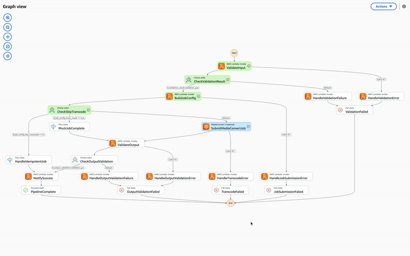
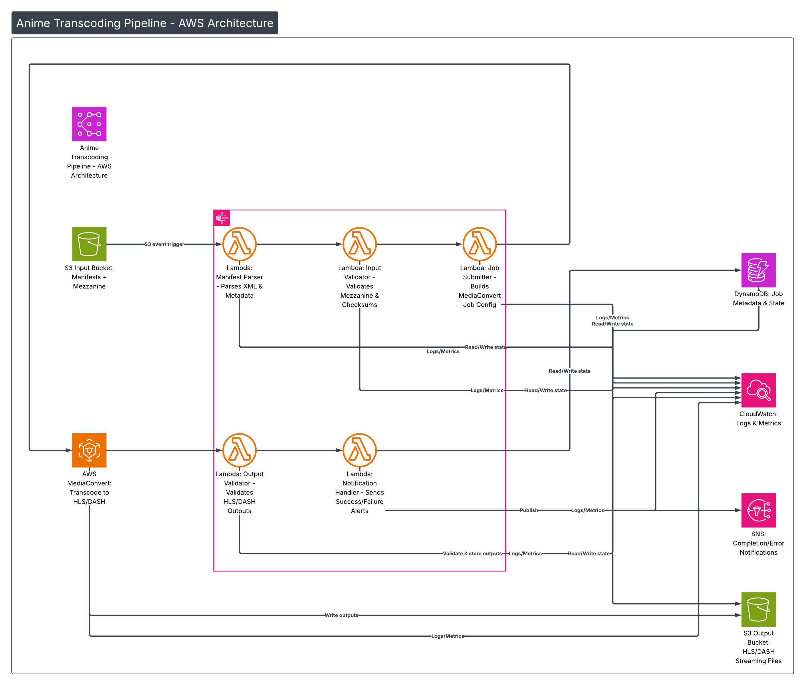
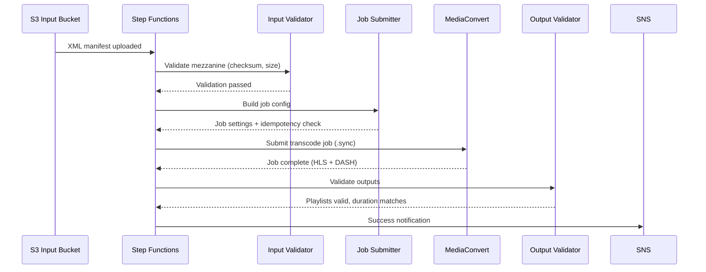

# Anime Transcoding Pipeline

> Production-grade video transcoding with the operational concerns that actually matter

[](https://www.terraform.io/)
[](https://www.python.org/)
[](https://aws.amazon.com/mediaconvert/)
[](https://opensource.org/licenses/MIT)

<p align="center">
  
  <br>
  <em>Step Functions execution: XML manifest → HLS/DASH output in ~30 seconds</em>
</p>

---

## What This Does

Drop an XML manifest into S3 → get production-ready HLS + DASH streaming assets.

```
Input:  1080p mezzanine + manifest.xml
Output: Adaptive bitrate ladder (1080p/720p/480p/360p) in HLS & DASH
Time:   ~30 seconds for a 10-second clip, ~15 minutes for a 24-minute episode
Cost:   ~$0.50-1.00 per episode
```

---

## The Operational Problems This Solves

This isn't a MediaConvert wrapper. It's a pipeline that handles the problems you don't think about until they cost you money:

| Problem | What Happens | How This Pipeline Handles It |
|---------|--------------|------------------------------|
| **Duplicate processing** | S3 event retries trigger the same job twice. You pay for two encodes. | DynamoDB conditional writes with idempotency tokens |
| **Encoder settings drift** | Your H.264 profile changes. Which 500 episodes need re-encoding? | Profile version in idempotency token—bump version to invalidate all |
| **Silent failures** | MediaConvert returns "SUCCESS" but HLS playlist is malformed | Output validation: parse playlists, verify segments, check duration |
| **Race conditions** | Two Lambdas check "is this processed?" simultaneously. Both say no. | Two-phase commit pattern with DynamoDB |

---

## Architecture

<p align="center">
  
</p>

```
┌──────────────────────────────────────────────────────────────────────────────┐
│                         ANIME TRANSCODING PIPELINE                           │
├──────────────────────────────────────────────────────────────────────────────┤
│                                                                              │
│   ┌─────────────┐         ┌─────────────────────────────────────────────┐    │
│   │ XML Manifest│────────▶│           Step Functions Orchestrator       │    │
│   │ + Mezzanine │         │                                             │    │
│   │   (S3)      │         │  ┌─────────┐  ┌─────────┐  ┌─────────────┐  │    │
│   └─────────────┘         │  │ Input   │  │  Job    │  │ MediaConvert│  │    │
│                           │  │Validator│─▶│Submitter│─▶│   (.sync)   │  │    │
│                           │  └─────────┘  └─────────┘  └─────────────┘  │    │
│                           │       │            │              │         │    │
│   ┌─────────────┐         │       │            │              │         │    │
│   │  DynamoDB   │◀────────│───────┴────────────┘              │         │    │
│   │(Idempotency)│         │                                   ▼         │    │
│   └─────────────┘         │  ┌───────────┐    ┌──────────────────────┐  │    │
│                           │  │  Output   │◀───│   HLS + DASH Output  │  │    │
│                           │  │ Validator │    │        (S3)          │  │    │
│                           │  └───────────┘    └──────────────────────┘  │    │
│                           │       │                                     │    │
│   ┌─────────────┐         │       ▼                                     │    │
│   │  CloudWatch │◀────────│  ┌─────────┐                                │    │
│   │  Dashboard  │         │  │ Notify  │                                │    │
│   └─────────────┘         │  │ (SNS)   │                                │    │
│                           │  └─────────┘                                │    │
│                           └─────────────────────────────────────────────┘    │
│                                                                              │
└──────────────────────────────────────────────────────────────────────────────┘
```

### Pipeline Flow



---

## Quick Start

### Option 1: Full AWS Deployment (10 minutes)

```bash
# Clone
git clone https://github.com/kprabhasreddy/anime-transcoding-pipeline.git
cd anime-transcoding-pipeline

# Setup Python
python -m venv .venv && source .venv/bin/activate
pip install -r requirements.txt

# Build Lambda packages
mkdir -p dist
cd src && zip -r ../dist/lambda-deployment.zip . && cd ..
pip install -r requirements-lambda.txt -t dist/layer/python
cd dist/layer && zip -r ../lambda-layer.zip python && cd ../..

# Deploy
cd terraform/environments/dev
terraform init && terraform apply

# Test it
aws s3 cp sample-data/mezzanines/test-video.mp4 \
  s3://$(terraform output -raw input_bucket_name)/mezzanines/

aws s3 cp sample-data/manifests/test-video-manifest.xml \
  s3://$(terraform output -raw input_bucket_name)/manifests/

# Watch it run
echo "https://console.aws.amazon.com/states/home#/statemachines"
```

### Option 2: Local Testing (No AWS costs)

```bash
# Run unit tests
pip install -r requirements.txt
pytest tests/ -v

# Test manifest parsing locally
python -c "
from src.manifest_parser.xml_parser import parse_anime_manifest
manifest = parse_anime_manifest(open('sample-data/manifests/test-video-manifest.xml').read())
print(f'Parsed: {manifest[\"manifest_id\"]} - {manifest[\"episode\"][\"series_title\"]}')
"

# Test ABR ladder generation
python -c "
from src.job_submitter.abr_ladder import get_abr_ladder
variants = get_abr_ladder(1920, 1080, enable_h265=True)
for v in variants:
    print(f'{v.codec.value:5} {v.resolution:10} @ {v.bitrate_kbps:5} kbps')
"
```

---

## Design Decisions

### Idempotency with Profile Versioning

The idempotency token includes the encoding profile version. Bump `v1.0` → `v2.0` when settings change, and previously-processed content automatically becomes eligible for re-encoding.

```python
# src/job_submitter/idempotency.py
key_components = [
    manifest.manifest_id,
    manifest.mezzanine.checksum_md5,
    str(manifest.mezzanine.file_size_bytes),
    str(sorted([t.language for t in manifest.audio_tracks])),
    profile_version,  # ← Change this to invalidate all previous encodes
]
```

### Two-Phase Commit for Job Submission

DynamoDB conditional writes prevent the race condition where concurrent Lambdas both think they should process a manifest:

```python
# Phase 1: Atomic slot reservation
table.put_item(
    Item={"idempotency_token": token, "status": "PENDING"},
    ConditionExpression="attribute_not_exists(idempotency_token)"
)

# Phase 2: Confirm after MediaConvert accepts
table.update_item(...)
```

### Output Validation

MediaConvert "SUCCESS" means the encoder finished, not that outputs are correct. The pipeline validates:

- HLS master playlist parses correctly
- All variant playlists exist and reference valid segments
- DASH MPD is well-formed XML with correct structure
- Duration matches source (±0.5s tolerance)

### QVBR Rate Control

Quality-defined variable bitrate instead of CBR. The encoder decides per-frame bitrate allocation—it's better at this than a static target.

```python
"QvbrSettings": {
    "QvbrQualityLevel": 7,      # 1-10 scale, 7 recommended for streaming
    "MaxAverageBitrate": 6_000_000,
}
```

### ABR Ladder

| Resolution | H.264 | H.265 | Notes |
|------------|-------|-------|-------|
| 1920×1080 | 6.0 Mbps | 4.5 Mbps | Primary quality |
| 1280×720 | 3.5 Mbps | 2.5 Mbps | Tablet / good mobile |
| 854×480 | 1.8 Mbps | — | Mobile fallback |
| 640×360 | 0.8 Mbps | — | Low bandwidth |

No H.265 at low resolutions—devices with poor connections often lack hardware HEVC decoders.

---

## Manifest Format

```xml
<?xml version="1.0" encoding="UTF-8"?>
<AnimeTranscodeManifest version="1.0">
    <ManifestId>unique-episode-id</ManifestId>

    <Episode>
        <SeriesId>attack-on-titan</SeriesId>
        <SeriesTitle>Attack on Titan</SeriesTitle>
        <SeasonNumber>1</SeasonNumber>
        <EpisodeNumber>1</EpisodeNumber>
        <EpisodeTitle>To You, in 2000 Years</EpisodeTitle>
        <DurationSeconds>1440.0</DurationSeconds>
    </Episode>

    <Mezzanine>
        <FilePath>mezzanines/aot-s01e01.mp4</FilePath>
        <ChecksumMD5>abc123...</ChecksumMD5>
        <ChecksumXXHash>def456...</ChecksumXXHash>
        <FileSizeBytes>5368709120</FileSizeBytes>
        <ResolutionWidth>1920</ResolutionWidth>
        <ResolutionHeight>1080</ResolutionHeight>
    </Mezzanine>

    <AudioTracks>
        <AudioTrack>
            <Language>ja</Language>
            <Label>Japanese</Label>
            <IsDefault>true</IsDefault>
        </AudioTrack>
        <AudioTrack>
            <Language>en</Language>
            <Label>English Dub</Label>
        </AudioTrack>
    </AudioTracks>
</AnimeTranscodeManifest>
```

---

## Configuration

### Environment Variables

| Variable | Description | Default |
|----------|-------------|---------|
| `ENVIRONMENT` | dev/staging/prod | dev |
| `ENABLE_H265` | Include HEVC variants | true |
| `ENABLE_DASH` | Output DASH in addition to HLS | true |
| `MOCK_MODE` | Skip actual MediaConvert (for testing) | false |

### Terraform Variables

```hcl
# terraform/environments/dev/terraform.tfvars
aws_region          = "us-east-1"
environment         = "dev"
notification_emails = ["alerts@example.com"]
enable_h265         = true
enable_dash         = true
mock_mode           = false
```

---

## Cost Estimate

| Resource | Free Tier | Typical Episode (~24 min) |
|----------|-----------|---------------------------|
| **MediaConvert** | 20 min/month | ~$0.50-1.00 |
| **Step Functions** | 4,000 transitions/month | ~$0.10 |
| **Lambda** | 1M requests/month | Negligible |
| **S3 Storage** | 5 GB | ~$0.02/GB/month |
| **DynamoDB** | 25 GB + 200M requests | Negligible |

**Total per episode: ~$0.50-1.50** (mostly MediaConvert)

---

## Project Structure

```
├── src/
│   ├── shared/                 # Config, models, AWS clients
│   ├── manifest_parser/        # XML ingestion + validation
│   ├── input_validator/        # Checksum verification
│   ├── job_submitter/          # Idempotency + MediaConvert job builder
│   ├── output_validator/       # HLS/DASH validation
│   └── notification_handler/   # SNS notifications
│
├── terraform/
│   ├── modules/
│   │   ├── lambda-functions/
│   │   ├── step-functions/
│   │   ├── s3-buckets/
│   │   ├── mediaconvert/
│   │   └── cloudwatch-monitoring/
│   └── environments/
│       └── dev/
│
├── sample-data/
│   ├── manifests/              # Example XML manifests
│   └── mezzanines/             # Test video files
│
├── scripts/
│   ├── create-test-video.sh    # Generate test mezzanine
│   └── generate-signed-url.py  # CloudFront signed URLs
│
├── tests/                      # pytest + moto
└── docs/
    └── assets/                 # Architecture diagrams, GIFs
```

---

## Key Tradeoffs

| Decision | Rationale | Cost |
|----------|-----------|------|
| Step Functions over SQS | Visual debugging, `.sync` waits for MediaConvert natively | ~$0.025/1000 transitions |
| Single DynamoDB table | Cost efficiency, GSIs for all access patterns | Query complexity |
| Dual H.264/H.265 encode | Compatibility + modern device optimization | 2× encoding time |
| Profile version in token | Re-encoding without database changes | Slightly larger tokens |

---

## What I'd Reconsider at Scale

- **Step Functions Express** — Standard workflows charge per transition. Express is $1/million.
- **Per-title encoding profiles** — Action sequences need more bitrate than dialogue.
- **Segment-level parallelism** — Chunk the mezzanine and encode in parallel.
- **Audio loudness normalization** — Studios deliver at inconsistent levels.

---

## Monitoring

The pipeline includes a CloudWatch dashboard with:

- Execution success/failure rates
- MediaConvert job duration
- Lambda error rates
- S3 storage metrics

Access it after deployment:
```bash
terraform output cloudwatch_dashboard_url
```

---

## Cleanup

```bash
# Empty buckets first (required before terraform destroy)
aws s3 rm s3://$(terraform output -raw input_bucket_name) --recursive
aws s3 rm s3://$(terraform output -raw output_bucket_name) --recursive

# Destroy infrastructure
terraform destroy
```

---

## License

MIT

---

## Acknowledgments

Built with AWS Lambda Powertools, Terraform, and too much coffee.
