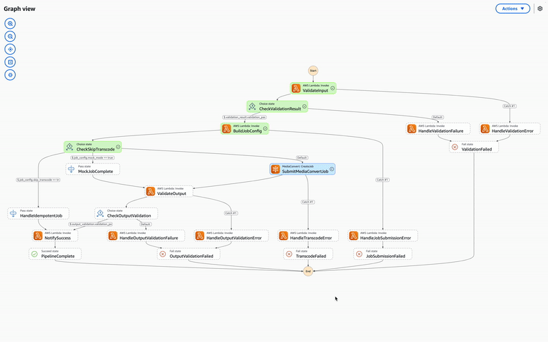

# Anime Transcoding Pipeline

> Production-grade video transcoding with the operational concerns that actually matter

[](https://www.terraform.io/)
[](https://www.python.org/)
[](https://aws.amazon.com/mediaconvert/)
[](https://opensource.org/licenses/MIT)

<!-- TODO: Add GIF of pipeline execution here -->
<!--  -->

## The Operational Problems

This isn't a MediaConvert wrapper. It's a pipeline that handles the problems you don't think about until they cost you money:

- **Duplicate processing** — S3 event retries trigger the same job twice. Now you've paid for two encodes.
- **Encoder settings drift** — Your H.264 profile changes. Which 500 episodes need re-encoding? How do you track that?
- **Silent failures** — MediaConvert returns "SUCCESS" but the HLS playlist is malformed. Users see errors.
- **Race conditions** — Two Lambdas check "is this processed?" simultaneously. Both say no. Both submit jobs.

---

## Architecture

<!-- TODO: Replace with Excalidraw/Lucidchart diagram -->

```
┌──────────────────────────────────────────────────────────────────────────────┐
│                         ANIME TRANSCODING PIPELINE                           │
├──────────────────────────────────────────────────────────────────────────────┤
│                                                                              │
│   ┌─────────────┐         ┌─────────────────────────────────────────────┐   │
│   │ XML Manifest│────────▶│           Step Functions Orchestrator       │   │
│   │ + Mezzanine │         │                                             │   │
│   │   (S3)      │         │  ┌─────────┐  ┌─────────┐  ┌─────────────┐ │   │
│   └─────────────┘         │  │ Input   │  │  Job    │  │ MediaConvert│ │   │
│                           │  │Validator│─▶│Submitter│─▶│   (.sync)   │ │   │
│                           │  └─────────┘  └─────────┘  └─────────────┘ │   │
│                           │       │            │              │         │   │
│   ┌─────────────┐         │       │            │              │         │   │
│   │  DynamoDB   │◀────────│───────┴────────────┘              │         │   │
│   │(Idempotency)│         │                                   ▼         │   │
│   └─────────────┘         │  ┌───────────┐    ┌──────────────────────┐ │   │
│                           │  │  Output   │◀───│   HLS + DASH Output  │ │   │
│                           │  │ Validator │    │        (S3)          │ │   │
│                           │  └───────────┘    └──────────────────────┘ │   │
│                           │       │                      │              │   │
│   ┌─────────────┐         │       ▼                      ▼              │   │
│   │  CloudWatch │◀────────│  ┌─────────┐         ┌────────────┐        │   │
│   │  Dashboard  │         │  │ Notify  │         │ CloudFront │        │   │
│   └─────────────┘         │  │ (SNS)   │         │   (CDN)    │        │   │
│                           │  └─────────┘         └────────────┘        │   │
│                           └─────────────────────────────────────────────┘   │
│                                                                              │
└──────────────────────────────────────────────────────────────────────────────┘
```

---

## Design Decisions

### Idempotency with Profile Versioning

The idempotency token includes the encoding profile version. Bump `v1.0` → `v2.0` when settings change, and previously-processed content automatically becomes eligible for re-encoding. No migration scripts, no manual tracking.

```python
# src/job_submitter/idempotency.py
key_components = [
    manifest.manifest_id,
    manifest.mezzanine.checksum_md5,
    str(manifest.mezzanine.file_size_bytes),
    str(sorted([t.language for t in manifest.audio_tracks])),
    profile_version,  # ← Change this to invalidate all previous encodes
]
```

### Two-Phase Commit for Job Submission

DynamoDB conditional writes prevent the race condition where concurrent Lambdas both think they should process a manifest:

```python
# Phase 1: Atomic slot reservation
table.put_item(
    Item={"idempotency_token": token, "status": "PENDING"},
    ConditionExpression="attribute_not_exists(idempotency_token)"
)

# Phase 2: Confirm after MediaConvert accepts
table.update_item(...)
```

### Output Validation

MediaConvert "SUCCESS" means the encoder finished, not that outputs are correct. The pipeline validates:
- HLS master playlist parses correctly
- All variant playlists exist and reference valid segments
- DASH MPD is well-formed
- Duration matches source (±0.5s tolerance)

### QVBR Rate Control

Quality-defined variable bitrate instead of CBR. The encoder decides per-frame bitrate allocation—it's better at this than a static target.

```python
"QvbrSettings": {
    "QvbrQualityLevel": 7,
    "MaxAverageBitrate": 6_000_000,
}
```

### ABR Ladder

| Resolution | H.264 | H.265 | Notes |
|------------|-------|-------|-------|
| 1920×1080 | 6.0 Mbps | 4.5 Mbps | Primary quality |
| 1280×720 | 3.5 Mbps | 2.5 Mbps | Tablet / good mobile |
| 854×480 | 1.8 Mbps | — | Mobile fallback |
| 640×360 | 0.8 Mbps | — | Low bandwidth |

No H.265 at low resolutions—devices with poor connections often lack hardware HEVC decoders. The bandwidth savings don't justify compatibility issues.

GOP size is 48 frames (2 seconds at 24fps). Shorter GOPs improve seek latency but hurt compression efficiency.

---

## Key Tradeoffs

| Decision | Rationale | Cost |
|----------|-----------|------|
| Step Functions over SQS | Visual debugging, `.sync` waits for MediaConvert natively | ~$0.025/1000 transitions |
| Single DynamoDB table | Cost efficiency, GSIs for all access patterns | Query complexity |
| Dual H.264/H.265 encode | Compatibility + modern device optimization | 2× encoding cost |
| Profile version in token | Re-encoding without database changes | Slightly larger tokens |

---

## What I'd Reconsider at Scale

- **Step Functions Express** — Standard workflows charge per transition. Express is $1/million requests.
- **Per-title encoding profiles** — Action sequences need more bitrate than dialogue. Content classification could optimize this.
- **Segment-level parallelism** — Chunking the mezzanine and encoding in parallel would reduce turnaround significantly.
- **Audio loudness normalization** — Studios deliver at inconsistent levels.

---

## Deployment Guide

**What you're deploying:** Backend infrastructure only—Lambda functions, Step Functions state machine, S3 buckets, DynamoDB, CloudFront distribution. There is no frontend. You interact with the pipeline by uploading files to S3 and monitoring via AWS Console.

### Prerequisites

- Python 3.11+
- Terraform 1.5+
- AWS CLI configured with credentials
- AWS account with MediaConvert enabled (visit MediaConvert console once to activate)

### 1. Clone and Setup

```bash
git clone https://github.com/kprabhasreddy/anime-transcoding-pipeline.git
cd anime-transcoding-pipeline

python -m venv .venv
source .venv/bin/activate  # Windows: .venv\Scripts\activate
pip install -r requirements.txt
```

### 2. Build Lambda Packages

```bash
mkdir -p dist

# Package Lambda functions
cd src && zip -r ../dist/lambda-deployment.zip . && cd ..

# Package Lambda layer (dependencies only)
pip install -r requirements-lambda.txt -t dist/layer/python
cd dist/layer && zip -r ../lambda-layer.zip python && cd ../..
```

### 3. Configure Terraform

```bash
cd terraform/environments/dev
```

Edit `terraform.tfvars` with your settings:
```hcl
aws_region          = "us-east-1"
environment         = "dev"
lambda_zip_path     = "../../../dist/lambda-deployment.zip"
layer_zip_path      = "../../../dist/lambda-layer.zip"
notification_emails = ["your-email@example.com"]

# Set to true to test without MediaConvert costs
mock_mode = false

# Feature flags
enable_h265 = true
enable_dash = true
```

### 4. Deploy Infrastructure

```bash
terraform init
terraform plan    # Review what will be created
terraform apply   # Type 'yes' to confirm
```

Note the outputs—you'll need `input_bucket_name`, `output_bucket_name`, and `cloudfront_domain`.

### 5. Trigger a Transcode Job

The pipeline triggers when you upload an XML manifest to S3. A sample manifest is included:

```bash
# Upload the sample manifest
aws s3 cp ../../../sample-data/manifests/attack-on-titan-s1e1.xml \
  s3://$(terraform output -raw input_bucket_name)/manifests/

# You'll also need to upload the actual mezzanine file referenced in the manifest
# The sample manifest expects: mezzanines/attack-on-titan/s01/e01/aot_s01e01_mezzanine.mxf
```

### 6. Monitor Execution

**Step Functions Console:**
```
https://console.aws.amazon.com/states/home?region=us-east-1#/statemachines
```
Click on the state machine to see execution history and the visual workflow.

**CloudWatch Logs:**
```bash
# View Lambda logs
aws logs tail /aws/lambda/anime-transcoding-manifest-parser-dev --follow
```

### 7. Access Transcoded Output

Outputs are written to the output S3 bucket:
```bash
# List transcoded files
aws s3 ls s3://$(terraform output -raw output_bucket_name)/ --recursive
```

**Playing via CloudFront (with signed URLs):**

CloudFront is configured to require signed URLs. To generate one:

```bash
# First, you need a CloudFront key pair. Create one in AWS Console:
# CloudFront > Key management > Public keys

# Then generate a signed URL:
pip install cryptography  # If not already installed

python ../../../scripts/generate-signed-url.py \
  --key-pair-id YOUR_KEY_PAIR_ID \
  --private-key-file /path/to/private_key.pem \
  --url "https://$(terraform output -raw cloudfront_domain)/series/attack-on-titan/s01/e01/hls/master.m3u8" \
  --expires-in 86400
```

The signed URL can be opened in VLC, Safari, or any HLS-compatible player.

**Direct S3 Access (for testing):**
```bash
# Generate a presigned URL (bypasses CloudFront, good for testing)
aws s3 presign s3://$(terraform output -raw output_bucket_name)/series/attack-on-titan/s01/e01/hls/master.m3u8 --expires-in 3600
```

### 8. Cleanup

```bash
# Empty S3 buckets first (Terraform can't delete non-empty buckets)
aws s3 rm s3://$(terraform output -raw input_bucket_name) --recursive
aws s3 rm s3://$(terraform output -raw output_bucket_name) --recursive

# Destroy infrastructure
terraform destroy
```

### Mock Mode (No MediaConvert Costs)

Set `mock_mode = true` in `terraform.tfvars` to test the pipeline without actual transcoding. The Step Functions workflow will execute, but MediaConvert calls are simulated.

---

## Project Structure

```
├── src/
│   ├── shared/              # Config, models, clients
│   ├── manifest_parser/     # XML ingestion
│   ├── input_validator/     # Checksum, file size
│   ├── job_submitter/       # Idempotency, job config
│   ├── output_validator/    # HLS/DASH verification
│   └── notification_handler/
│
├── terraform/
│   ├── modules/             # s3, lambda, step-functions, mediaconvert, etc.
│   └── environments/dev/
│
├── scripts/
│   ├── generate-signed-url.py  # CloudFront signed URL generator
│   └── create-test-video.sh    # Generate test mezzanine files
│
├── sample-data/
│   └── manifests/           # Example XML manifests
│
└── tests/                   # pytest + moto
```

---

## Cost Estimate

| Resource | Per Episode |
|----------|-------------|
| MediaConvert | ~$0.50-1.00 |
| Step Functions | ~$0.10 |
| Lambda | Negligible |
| S3 + CloudFront | Variable |

---

## License

MIT
